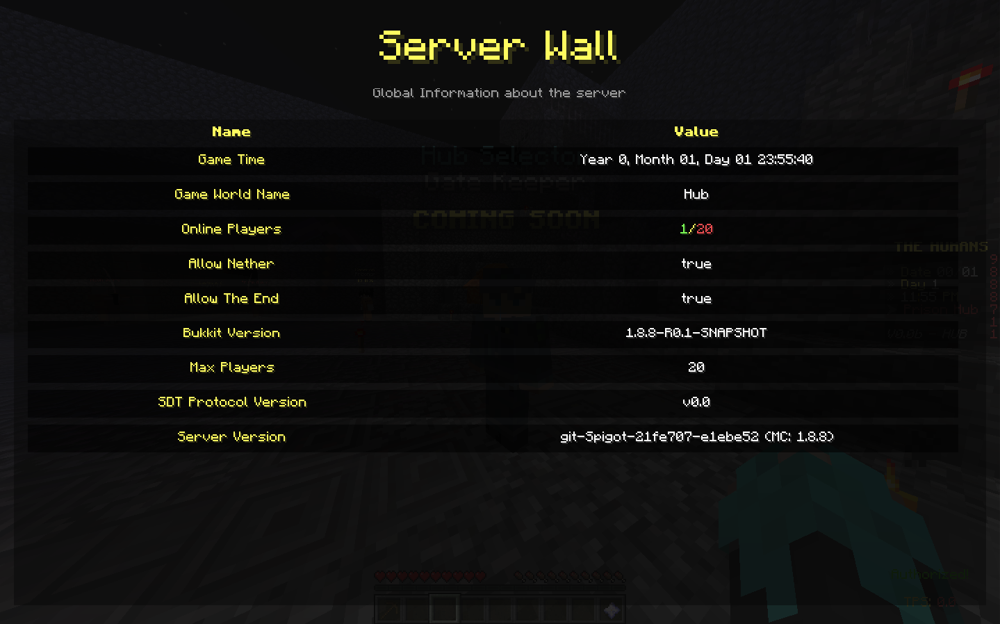
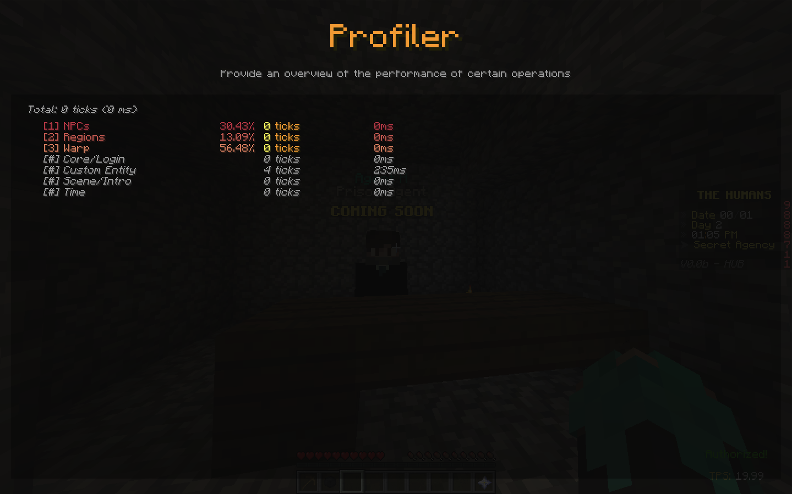
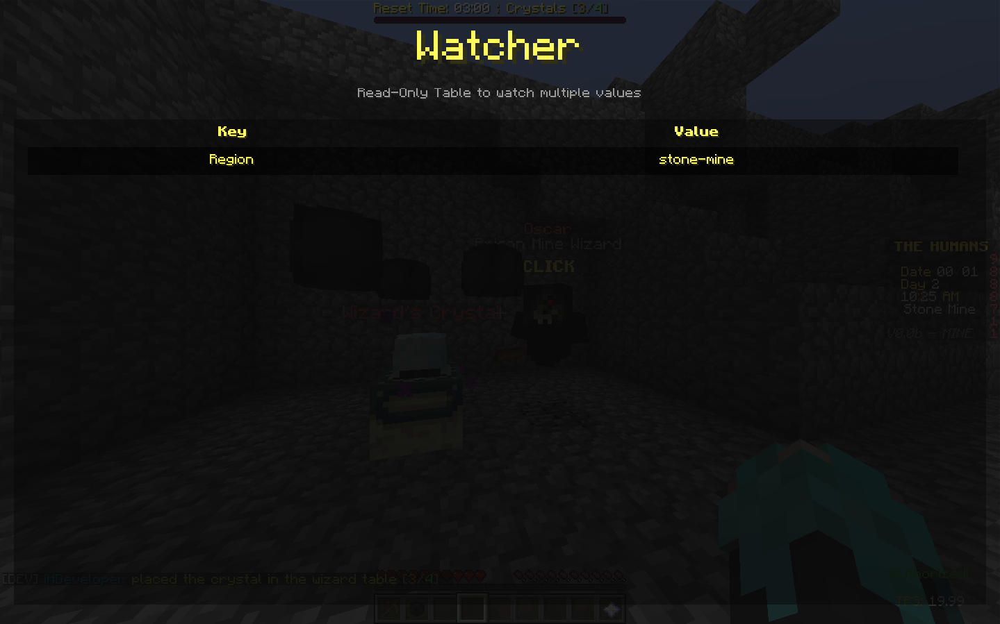

[](https://jitpack.io/#iHDeveloper/spigot-dev-tools)
# Spigot Dev Tools
Lightweight spigot library to provide developer tools to monitor/debug the Minecraft game world.

**Note:** This project is in the alpha state.
If you found any bug/glitch, open an issue in the [issue tracker](https://github.com/iHDeveloper/spigot-dev-tools/issues).

## 🌃⠀Showcase
[[Old] Youtube](https://youtu.be/BXlPDq4DVlw)

### Server Wall

Global information about the server
```java
DevTools.pin("Max Players", "20");
DevTools.unpin("Max Players");
```

### Profiler

Overview of the performance of certain operations in the server
```java
DevTools.profileStart("Regions");
/* Regions calculation */
DevTools.profileEnd("Regions");
```

### Watcher

Read-Only table to watch multiple values (different for each player)
```java
DevTools.watch("Winner", winnerName);
DevTools.unwatch("Winner"); /* Broadcasted to all online players ONLY! */

DevTools.watch(player, "Region", regionName);
DevTools.unwatch(player, "Region");
```

### TPS

Overview of the server cycle performance (aka TPS).
```java
/* Enabled by default! */
```

## 📦⠀Modules
- `~` (aka root) is Spigot plugin to host the custom plugin messaging channel
- `~/legacy-mod` is forge mod (1.8.9) for providing graphical developer tools

## 🗓⠀Protocol
You can view the protocol structure and design [here](./PROTOCOL.md).

## 🗄⠀Download
### Plugin
You can download the main plugin from [here](https://github.com/iHDeveloper/spigot-dev-tools/releases/tag/v0.2.1-alpha)
### API
- Maven
```xml
<repositories>
    <repository>
        <id>jitpack.io</id>
        <url>https://jitpack.io</url>
    </repository>
</repositories>

<dependency>
<groupId>me.ihdeveloper</groupId>
<artifactId>spigot-dev-tools</artifactId>
<version>v0.2.1-alpha</version>
<classifier>api</classifier>
<scope>provided</scope> <!-- The API is already included with the plugin -->
</dependency>
```

- Groovy
```groovy
compileOnly 'me.ihdeveloper:spigot-dev-tools:v0.2.1-alpha:api';
```

- Kotlin DSL
```kotlin
compileOnly("me.ihdeveloper:spigot-dev-tools:v0.2.1-alpha:api")
```

- Scratch
  If you don't want to use the options above, then you can download the API from [here](https://github.com/iHDeveloper/spigot-dev-tools/releases/tag/v0.2.1-alpha)

### Dependency
Add this to your `plugin.yml` to load the plugin before your plugin.
```yml
depend:
  - SpigotDevTools
```

## 👨‍💻⠀Credits
This project is made with ❤️⠀by @iHDeveloper
