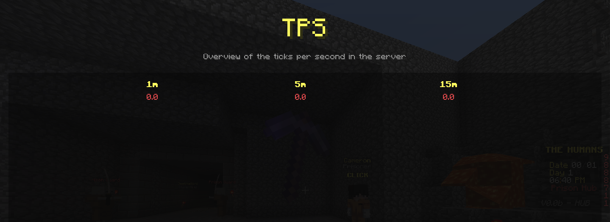

[](https://jitpack.io/#iHDeveloper/spigot-dev-tools)
# Spigot Dev Tools
Lightweight spigot library to provide developer tools to monitor/debug the Minecraft game world.

## Showcase
[[Old] Youtube](https://youtu.be/BXlPDq4DVlw)

### Server Wall

Global information about the server

### Profiler

Overview of the performance of certain operations in the server

### Watcher

Read-Only table to watch multiple values (different for each player)

### TPS

Overview of the server cycle performance (aka TPS).

## 📦⠀Modules
- `~` (aka root) is Spigot plugin to host the custom plugin messaging channel
- `~/legacy-mod` is forge mod (1.8.9) for providing graphical developer tools

## 🗄⠀Download
### Plugin
You can download the main plugin from [here](https://github.com/iHDeveloper/spigot-dev-tools/releases/tag/v0.2.1-alpha)
### API
- Maven
```xml
<repositories>
    <repository>
        <id>jitpack.io</id>
        <url>https://jitpack.io</url>
    </repository>
</repositories>

<dependency>
<groupId>me.ihdeveloper</groupId>
<artifactId>spigot-dev-tools</artifactId>
<version>v0.2.1-alpha</version>
<classifier>api</classifier>
<scope>provided</scope> <!-- The API is already included with the plugin -->
</dependency>
```

- Groovy
```groovy
compileOnly 'me.ihdeveloper:spigot-dev-tools:v0.2.1-alpha:api';
```

- Kotlin DSL
```kotlin
compileOnly("me.ihdeveloper:spigot-dev-tools:v0.2.1-alpha:api")
```

- Scratch
  If you don't want to use the options above, then you can download the API from [here](https://github.com/iHDeveloper/spigot-dev-tools/releases/tag/v0.2.1-alpha)
