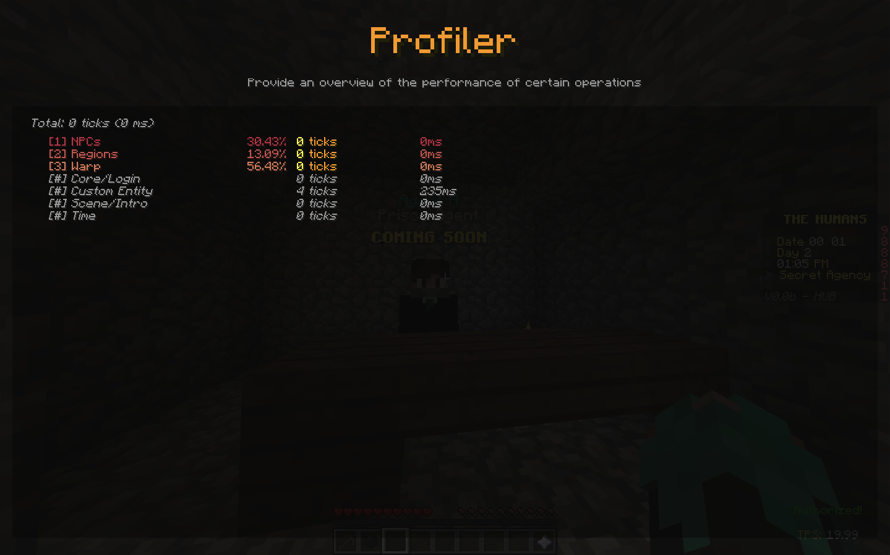
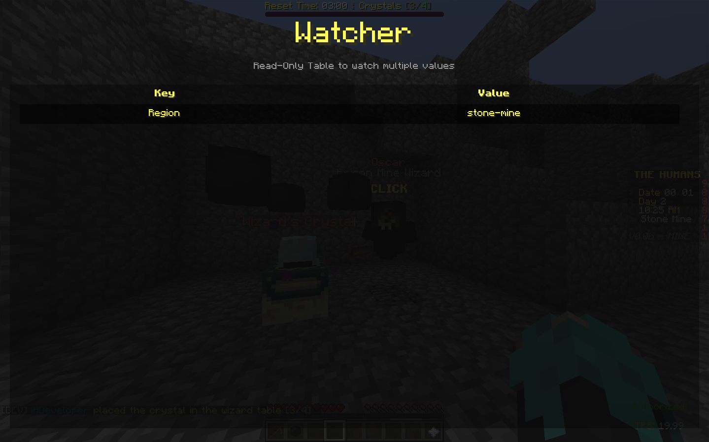

# Screenshots
This page includes screenshots of every feature in the spigot developer tools.

## Server Wall

Global information about the server
```java
DevTools.pin("Max Players", "20");
DevTools.unpin("Max Players");
```

## Profiler

Overview of the performance of certain operations in the server
```java
DevTools.profileStart("Regions");
/* Regions calculation */
DevTools.profileEnd("Regions");
```

## Logger

Records events that occur in the server
```java
DevTools.logger().info("This server is using the test plugin of §eSpigot Dev Tools!");
DevTools.logger().info("§ePlugin By §c@iHDeveloper");
DevTools.logger().info("Example of info log message!");
DevTools.logger().warn("Example of warn log message!");
DevTools.logger().err("Example of error log message!");
DevTools.logger().debug("Example of debug log message!");
DevTools.logger().debug("Example of debug log message!");
```

## Watcher

Read-Only table to watch multiple values (different for each player)
```java
DevTools.watch("Winner", winnerName);
DevTools.unwatch("Winner"); /* Broadcasted to all online players ONLY! */

DevTools.watch(player, "Region", regionName);
DevTools.unwatch(player, "Region");
```

## TPS

Overview of the server cycle performance (aka TPS).
```java
/* Enabled by default! */
```
